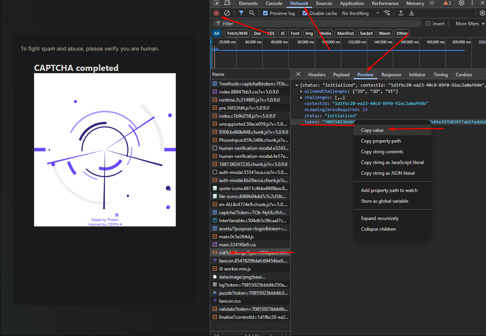
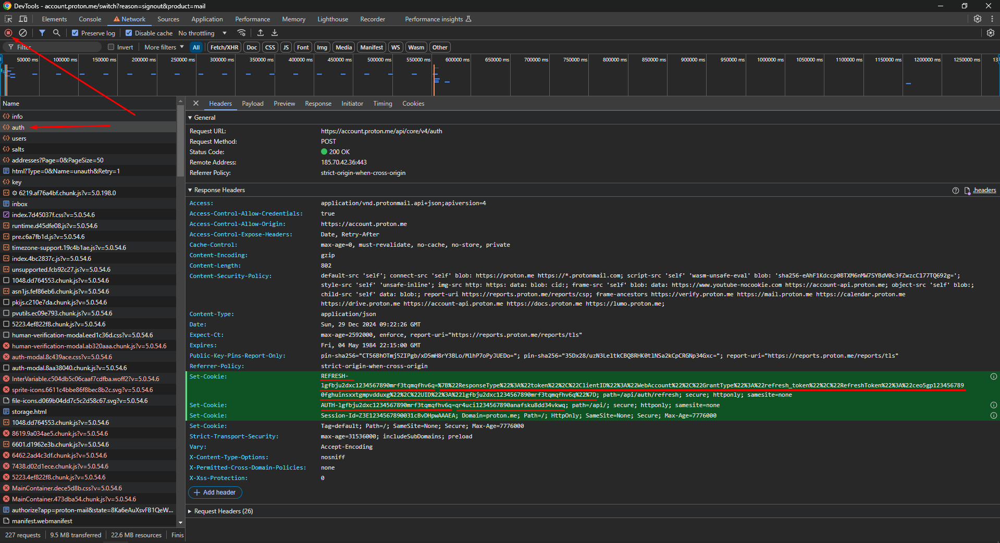

This is not an official python ProtonMail API client. it allows you to read, send and delete messages in protonmail, as well as render a ready-made template with embedded images.


## Installation
``` 
pip install protonmail-api-client
```

## Using
```py
from protonmail import ProtonMail

username = "YouAddress@proton.me"
password = "YourPassword123"

proton = ProtonMail()
proton.login(username, password)

# Get a list of all messages
messages = proton.get_messages()

# Read the latest message
message = proton.read_message(messages[0])
print(message.sender.address)  # sender address
print(message.subject)  # subject
print(message.body)
# <html><body><div>it's my image: ....

# Render the template, images downloading, converting to BASE64 and insert into html
proton.render(message)
# This is a ready-made html page, with all the pictures, you can save it right away
with open('message.html', 'w', encoding='utf-8') as f:
    f.write(message.body)
print(message.body)
# <html><body><div>it's my image: ....

# Download file from message
first_file = message.attachments[0]
proton.download_files([first_file])
with open(f'{first_file.name}', 'wb') as f:
    f.write(first_file.content)

# Create attachments
with open('image.png', 'rb') as f:
    img = f.read()
with open('resume.pdf', 'rb') as f:
    pdf = f.read()

img_attachment = proton.create_attachment(content=img, name='image.png')
pdf_attachment = proton.create_attachment(content=pdf, name='resume.pdf')

html = f"""
<html>
    <body>
        <h2>Hi, I'm a python developer, here's my photo:</h2>
        
        <br/>
        Look at my resume, it is attached to the letter.
    </body>
</html>
"""

# Send message
new_message = proton.create_message(
    recipients=["to1@proton.me", "to2@gmail.com", "Name of recipient <to3@outlook.com>"],
    cc=["cc1@proton.me", "cc2@gmail.com", "Name of recipient <cc3@outlook.com>"],
    bcc=["bcc1@proton.me", "bcc2@gmail.com", "Name of recipient <bcc3@outlook.com>"],
    subject="My first message",
    body=html,  # html or just text
    attachments=[img_attachment, pdf_attachment],
    external_id="some-message-id-header-if-you-want-to-specify",
    in_reply_to="message-id-of-the-mail-to-reply-to",
)

sent_message = proton.send_message(new_message)

# Wait for new message
new_message = proton.wait_for_new_message(interval=1, timeout=60, rise_timeout=False, read_message=True)
if 'spam' in new_message.body:
    # Delete spam
    proton.delete_messages([new_message])

# Save session, you do not have to re-enter your login, password, pgp key, passphrase
# WARNING: the file contains sensitive data, do not share it with anyone,
# otherwise someone will gain access to your mail.
proton.save_session('session.pickle')

# Load session
proton = ProtonMail()
proton.load_session('session.pickle', auto_save=True)
# Autosave is needed to save tokens if they are updated
# (the access token is only valid for 24 hours and will be updated automatically)

# Getting a list of all sessions in which you are authorized
proton.get_all_sessions()

# Revoke all sessions except the current one
proton.revoke_all_sessions()
```

## Account Registration

This client now supports account registration. Here's a typical workflow:

```python
from protonmail import ProtonMail, UserType, TokenType, CaptchaConfig
from protonmail.exceptions import UsernameUnavailableError, VerificationError, RegistrationError, InvalidCaptcha

# Initialize the client
proton = ProtonMail()

new_username = "mybrandnewuser"
new_password = "SecurePassword123!"
verification_email = "my-recovery-email@example.com" # Email to receive verification code
proton_domain = "proton.me" # Or "protonmail.com", etc.

# 1. Check if username is available
try:
    if not proton.get_username_available(new_username):
        print(f"Username '{new_username}' is not available.")
        # exit or handle
    else:
        print(f"Username '{new_username}' is available.")
except Exception as e:
    print(f"Error checking username availability: {e}")
    # exit or handle

# 2. Send verification code to an external email address
try:
    proton.send_verification_code(new_username, verification_email)
    print(f"Verification code sent to {verification_email} for username {new_username}.")
except UsernameUnavailableError:
    print(f"Username '{new_username}' became unavailable.")
    # exit or handle
except VerificationError as e:
    print(f"Failed to send verification code: {e}")
    # exit or handle
except Exception as e:
    print(f"An unexpected error occurred while sending verification code: {e}")
    # exit or handle

# 3. Get the verification code from the user (e.g., via input)
verification_code = input(f"Enter the verification code sent to {verification_email}: ")

# 4. Create the user account
try:
    # Configure CAPTCHA handling if needed (e.g., for manual solving)
    # captcha_config = CaptchaConfig(type=CaptchaConfig.CaptchaType.MANUAL)
    # For auto-solving (default):
    captcha_config = CaptchaConfig(type=CaptchaConfig.CaptchaType.AUTO)

    newly_created_user = proton.create_user(
        username=new_username,
        password=new_password,
        verification_email=verification_email, # Currently not strictly used by API but good for context
        verification_code=verification_code,
        domain=proton_domain,
        captcha_config=captcha_config
    )
    print(f"Account created successfully: {newly_created_user.address}")

    # You can now log in with the new account
    # proton.login(newly_created_user.address, new_password)
    # print("Logged in with new account.")
    # proton.save_session(f'{new_username}_session.pickle')

except UsernameUnavailableError:
    print(f"Username '{new_username}' became unavailable before creation.")
except VerificationError as e:
    print(f"Verification failed during user creation: {e}")
except InvalidCaptcha as e:
    print(f"CAPTCHA challenge failed: {e}")
    print("If using AUTO CAPTCHA, you might need to retry or use MANUAL.")
except RegistrationError as e:
    print(f"Account registration failed: {e}")
except Exception as e:
    print(f"An unexpected error occurred during user creation: {e}")

```

**Important Notes on Registration:**
- **CAPTCHA:** Account creation often requires solving a CAPTCHA. The `create_user` method will attempt to handle this automatically if `CaptchaConfig.CaptchaType.AUTO` is used (default for `create_user`). If auto-solving fails, or if you prefer manual solving, you can pass `CaptchaConfig(type=CaptchaConfig.CaptchaType.MANUAL)` to `create_user` and follow the manual CAPTCHA instructions (see below).
- **Verification:** Currently, only email-based verification is shown. SMS verification might have a similar flow but would use `TokenType.SMS`.
- **API Rate Limits:** Be mindful of API rate limits when attempting registration, especially automated retries.
- **ProtonMail Terms of Service:** Always ensure your use of the API complies with ProtonMail's Terms of Service. Automated account creation might be restricted.


### event polling
Event polling. Polling ends in 3 cases:
1. Callback returns not `None`.
2. The callback raises the `SystemExit` exception.
3. Timeout ends.

For example, wait indefinitely until 2 messages arrive.
```python
def callback(response: dict, new_messages: list):
    messages = response.get('Messages', [])
    new_messages.extend(messages)
    if len(new_messages) >= 2:
        raise SystemExit

new_messages = []
proton.event_polling(callback, new_messages)
print(new_messages)
```
## CAPTCHA
### Solve CAPTCHA
Instructions to solve CAPTCHA:
1. At the moment automatic CAPTCHA solving is already implemented (used by default), it uses `cv2` and `NumPy`. Sometimes `CantSolveImageCaptcha` exception may occur, it means you encountered a complex image, just try to log in again.
2. You can use manual CAPTCHA solving:
   1. Login with `proton.login(username, password, captcha_config=CaptchaConfig(type=CaptchaConfig.CaptchaType.MANUAL))`
   2. You will see a url in the console, copy it.
   3. Open a new browser tab in incognito mode.
   4. Open the "DevTools" panel (press `F12`)
   5. Go to the "Network" tab.
   6. Enable network logging (press `CTRL + E`)
   7. Follow the copied url (from point 2.2)
   8. Solve the CAPTCHA.
   9. Find the `init` request in the "Network" tab and open it.
   10. In the "Preview" tab of the request, copy the token value.
   11. Paste the token into the python console.



### Avoid CAPTCHA
Instructions to avoid CAPTCHA:
1. There maybe a DDoS attack, just wait 1-2 days.
2. Stop logging into your account too often, use the `save_session` and `load_session` methods.
3. Change your IP address (for example, reboot your router, use VPN, Share mobile Internet).
4. If CAPTCHA also appears in your browser:
   1. Open a browser tab in incognito mode.
   2. Log into your account.
   3. Solve the CAPTCHA.
   4. Wait for your mail to load.
   5. Close the tab.
   6. Repeat this about 10 times, then your account (only this one) can be allowlisted, and authorization (including `protonmail-api-client`) will be without CAPTCHA.
5. Use `cookies` from the browser:
   1. Open a browser tab in incognito mode.
   2. Open the login page (https://account.proton.me/mail).
   3. Open the "DevTools" panel (press `F12`).
   4. Go to the "network" tab.
   5. Enable recording network log (press `CTRL + E`).
   6. Log in to your account (check "Keep me signed in").
   7. Find the `auth` request in the "Network" tab and open it.
   8. In the "Headers" tab of the request, scroll down to the `Set-Cookie` items in the "Response Headers" list.
   9. Copy the key and value from the cookies: `REFRESH-*`, `AUTH-*`.
   10. Paste the key and value into the following code (`x-pm-uid` is the part after `AUTH-`).
   11. Close the incognito tab (Do not click the "log out" button, otherwise cookies will be invalidated).
```python
proton = ProtonMail()

proton.session.headers['x-pm-uid'] = 'lgfbju2dxc1234567890mrf3tqmqfhv6q'  # This is the part after `AUTH-`
proton.session.cookies['AUTH-lgfbju2dxc1234567890mrf3tqmqfhv6q'] = 'qr4uci1234567890anafsku8dd34vkwq'
proton.session.cookies['REFRESH-lgfbju2dxc1234567890mrf3tqmqfhv6q'] = '%7B%22ResponseType%22%3A%22token%22%2C%22ClientID%22%3A%22WebAccount%22%2C%22GrantType%22%3A%22refresh_token%22%2C%22RefreshToken%22%3A%22ceo5gp1234567890fghuinsxxtgmpvdduxg%22%2C%22UID%22%3A%22lgfbju2dxc1234567890mrf3tqmqfhv6q%22%7D'

password = 'YourPassword123'
proton._parse_info_after_login(password)
proton.save_session('session.pickle')
```

